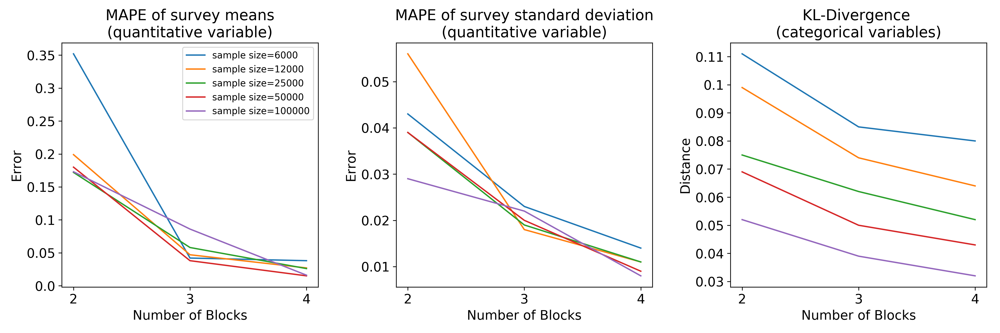

## Introduction
   Split surveys are used when there are too many survey questions to administer due to respondent fatigue. In this quick study , i splitted the survey into 15 blocks each with 20 survey questions and administered 2-4 blocks onto each participant. The missing responses due to the split-survey design are imputed(filled in) via the MICE algorithm.
   
   To benchmark this approach, I applied the methodology on a survey dataset with 400K respondants and 300 questions.This simple experiment studies the effect of survey sample size and number of question administered and the quality of the imputation obtain.

## Results

Qualitive variables are affected by sample size, but not quantitive variables, and more questions blocks lead to more precise estimates

### Run the entire code on the browser (you need access to your google account): [colabs link, click here ](https://colab.research.google.com/github/leexa90/ST5220/blob/master/ST5220.ipynb)

#### ABSTRACT
The objective of the BRFSS is to collect uniform, state-specific data on preventive health practices and risk behaviors that are linked to chronic diseases, injuries, and preventable infectious diseases in the adult population. Factors assessed by the BRFSS include tobacco use, health care coverage, HIV/AIDS knowledge or prevention, physical activity, and fruit and vegetable consumption. Data are collected from a random sample of adults (one per household) through a telephone survey.

The Behavioral Risk Factor Surveillance System (BRFSS) is the nation's premier system of health-related telephone surveys that collect state data about U.S. residents regarding their health-related risk behaviors, chronic health conditions, and use of preventive services. Established in 1984 with 15 states, BRFSS now collects data in all 50 states as well as the District of Columbia and three U.S. territories. BRFSS completes more than 400,000 adult interviews each year, making it the largest continuously conducted health survey system in the world.

Data explanation : codebook15_llcp.pdf

Data used 2015.csv

SOURCE : https://www.kaggle.com/cdc/behavioral-risk-factor-surveillance-system/home
